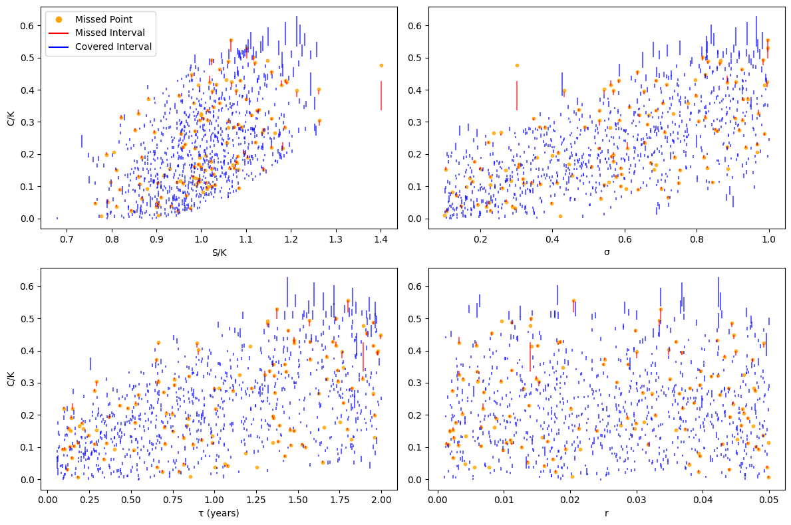
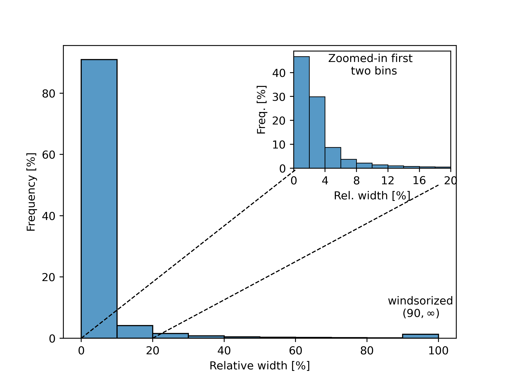
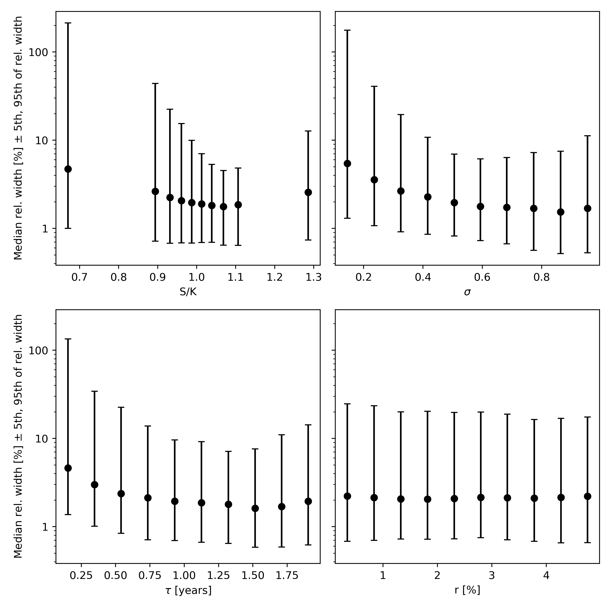
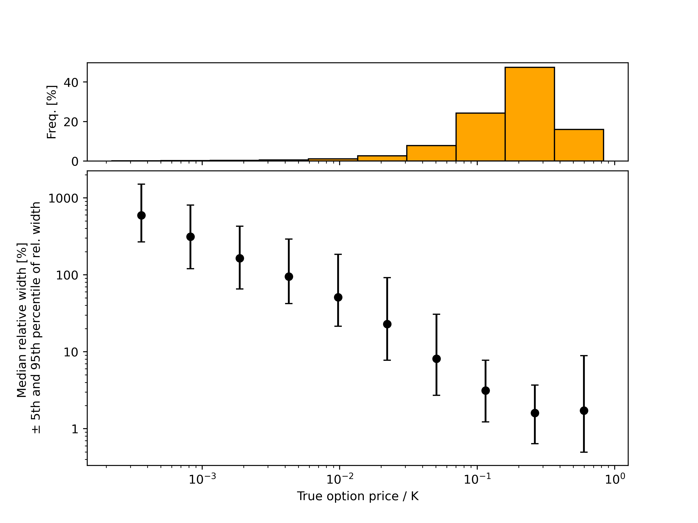
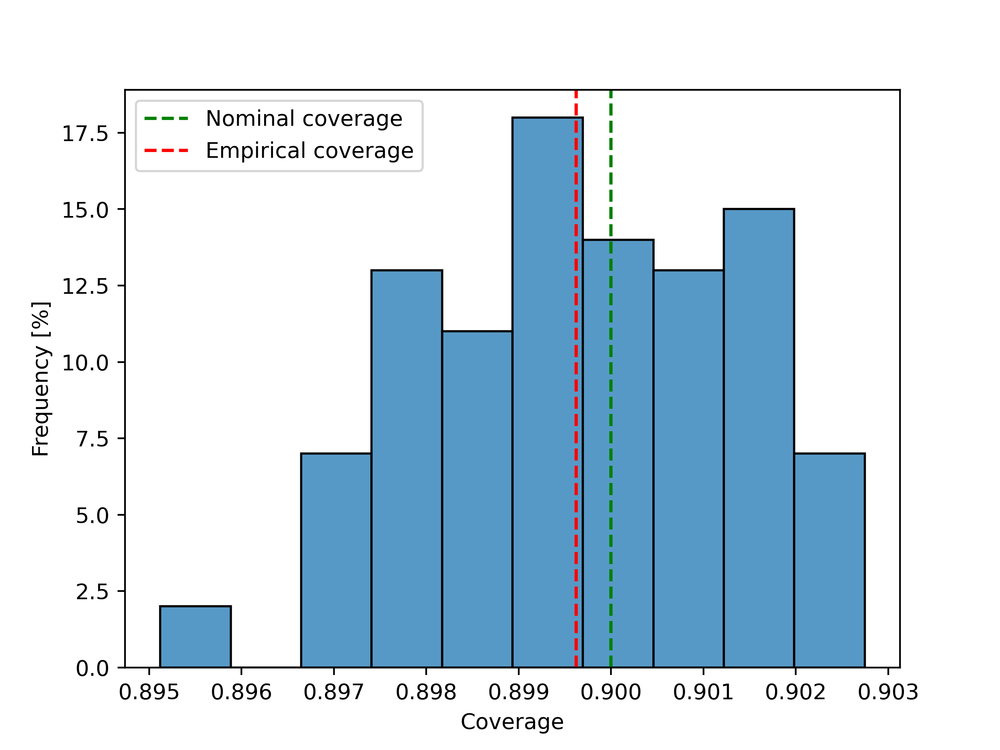
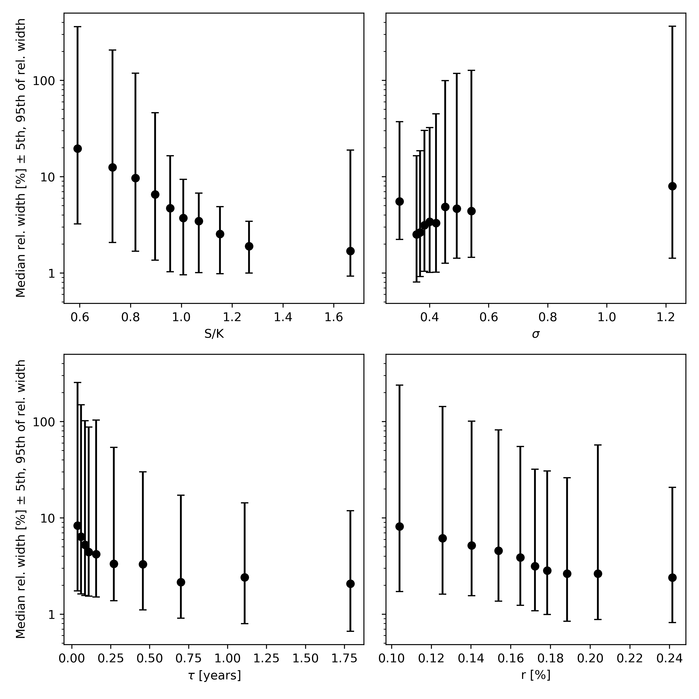
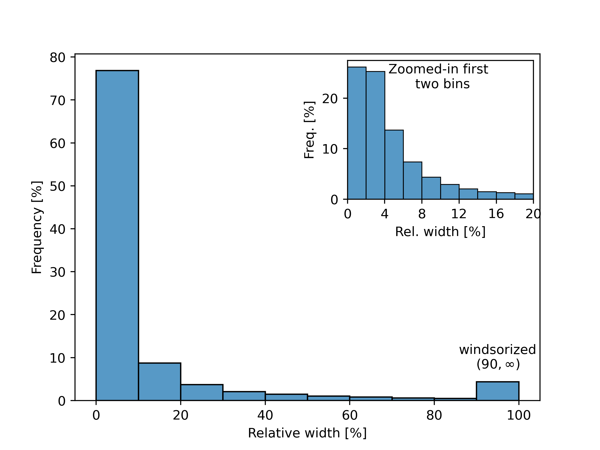
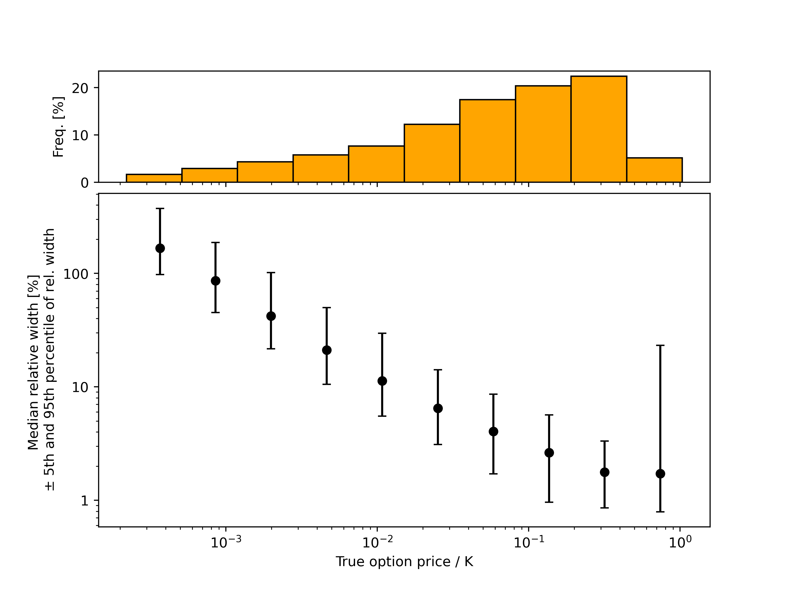
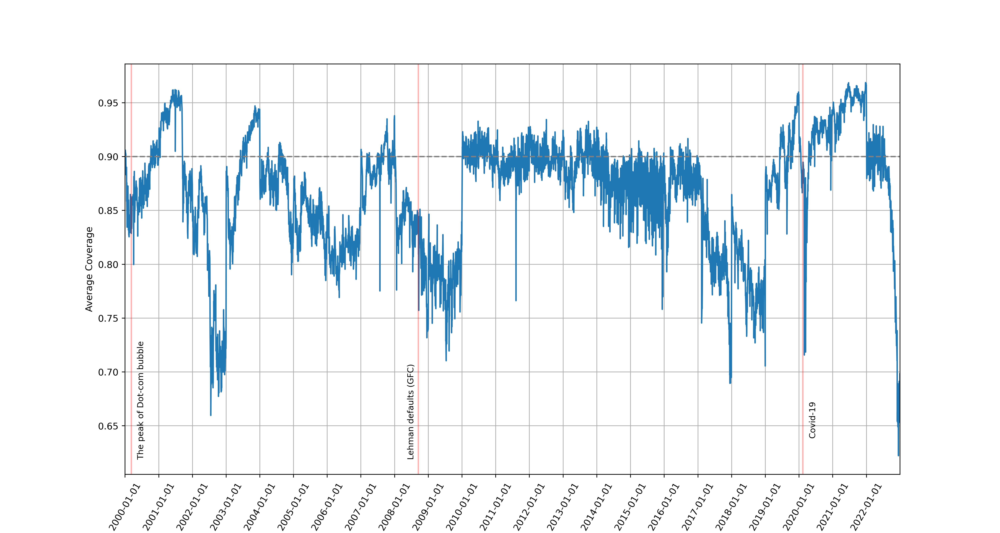

# Conformal Option Pricing <!-- omit in toc -->

Replication of ["Conformal prediction of option prices" by Joao A. Bastos](https://doi.org/10.1016/j.eswa.2023.123087), with some extensions. Authors: Miroslav Živanović, Oliver Löthgren, Naoaki Motobayashi.

## TL;DR: <!-- omit in toc -->

The Conformalized Quantile Regression (CQR) is applied to estimate prediction intervals of option prices. We follow the original methodology of Bastos 2024, and identify critical shortcomings in its empirical coverage tests - mainly its failure to recognize the non-exchangeability of option prices when the data is split into  calibration and test sets by respecting the temporal ordering of data (i.e. calibration before test). We fix this methodical issue in the following ways:

1. In experiments with real data we test the coverage in a walk-forward, out-of-time scheme, better matching the setup in which the model would be deployed in practice. We use much bigger data set: options written on constituents of the S\&P 500, during the period of time from 1996.01.01 to 2022.12.31.
2. In experiments with simulated data, each group of datapoints with the identical value of $(S, \sigma, \tau, r)$ but different strikes, are placed either into calibration or test set instead of randomly splitting them between the two sets.

**We conclude that option data is not exchangeable. This leads to a loss of coverage by the CQR. Non-exchangeability is likely due to covariate shifts rather then the hierarchical nature of option data.**

## Table of Contents <!-- omit in toc -->
- [Introduction](#introduction)
- [Experiments with Simulated Data](#experiments-with-simulated-data)
  - [Data Simulation](#data-simulation)
  - [Empirical Coverage](#empirical-coverage)
  - [Widths of PIs across feature and response space](#widths-of-pis-across-feature-and-response-space)
- [Replication of Results with Real Data](#replication-of-results-with-real-data)
  - [Data preprocessing](#data-preprocessing)
  - [Results](#results)
- [Walk-forward Testing with Real Data](#walk-forward-testing-with-real-data)
- [Conclusion](#conclusion)
- [Project Organization](#project-organization)

## Introduction

Conformal Prediction (CP) framework is a statistically rigorous framework for uncertainty qualification (UQ). In its main form, it provides a set of methods for constructing prediction sets, or in regression problems those become prediction intervals (PI), for point predictions of a model. Prediction intervals produced by CP have finite-sample coverage guarantees, by which we mean the following property of a prediction interval $C(X_{n+1})$, constructed using a finite calibration set, and for a test observation $Z_{n+1} = (X_{n+1}, Y_{n+1})$:
$$
    P(Y_{n+1} \in C(X_{n+1})) \geq 1 - \alpha,
$$
where $1 - \alpha$ is the nominal coverage level.

The framework is model-agnostic in the sense that it can be applied to any model trained by a symmetric learning algorithm (i.e. algorithm which is invariant, in expectation, under an arbitrary permutation of data). CP is valid under any distribution of data, as long as the data is exchangeable. This makes it suitable for a wide range of machine learning models.

A sequence of random variables $(Z_1, Z_2, \dots, Z_n)$ is **exchangeable** if its joint distribution is invariant under an arbitrary permutations $\pi$ of its indices:
$$
    P(Z_1, Z_2, \dots, Z_n) = P(Z_{\pi(1)}, Z_{\pi(2)}, \dots, Z_{\pi(n)}).
$$

The exchangeability of data is the crucial assumption for CP to guarantee coverage - it is not just a matter of theoretical convenience such as i.i.d. assumption in statistical learning theory. A seemingly minor violation of exchangeability can lead to poor coverage; informally, the "more non-exchangeable" data the larger the gap between nominal and actual coverage is. In practice, data is often non-exchangeable, so the right question is: "is data exchangeable enough?". Instead of quantifying non-exchangeability, we test the coverage of a CP method empirically. If a large coverage gap is observed, we should identify the source of non-exchangeability and adjust the CP method accordingly.

Instead of wrapping a point prediction model to obtain prediction intervals, we could train two quantile regression models to estimate directly the lower and upper quantiles, $q_{\alpha/2}(X)$ and $q_{1-\alpha/2}(X)$, of the conditional distribution of $Y$ given $X$. This approach, called **Conformalized Quantile Regression (CQR)**, have been used in Bastos 2024, and we use CQR in our analysis. The nonconformity score for CQR is:
$$
    S_i = \max\left[q_{\alpha/2}(X_i) - Y_i, Y_i - q_{1-\alpha/2}(X_i)\right].
$$
where $X_i$, $i=1, ..., n$, are from the calibration set $\mathcal{D}_n$. The prediction interval for a new observation $X_{n+1}$ is:
$$
    C(X_{n+1}) = \left[q_{\alpha/2}(X_{n+1}) - Q_{1-\alpha}, q_{1-\alpha/2}(X_{n+1}) + Q_{1-\alpha}\right].
$$
$$
    Q_{1-\alpha} = q_{(1-\alpha)(1+n)/n}\left(S_1, ..., S_n\right)
$$

 CQR effectively captures local variability in the data, making it particularly useful in applications where uncertainty varies greatly across the feature space, such as in the problem of option pricing. In addition to being more adaptive than a classical split conformal or full conformal approach, CQR has also been shown to produce tighter prediction intervals.

As in the original paper, we use the Light Gradient Boosting Machine (**LightGBM**) algorithm with the pinball loss as the quantile regression model for CQR. A grid search was performed to identify the optimal hyperparameters for each dataset (using its subsets, i.e validation sets). The hyperparameter search space is set identically as in the original paper:

| Hyperparameter               | Values                      |
|------------------------------|-----------------------------|
Number of Trees ($K$)         | \{100, 500, 1000, 2500, 5000\}
Maximum Depth ($d$)           | \{8, 16, 32, 64\}
Maximum Leaves per Tree ($l_{\max}$) | \{32, 64, 128, 256\}
Learning Rate ($\eta$)        | \{0.005, 0.01, 0.05, 0.1, 0.5\}

In the notebook `2.0-mz-hp-optim-sim.ipynb` we document hyperparameter optimization.

## Experiments with Simulated Data

Synthetic data was generated to replicate the data simulation procedure outlined in Bastos 2024. The goal is to establish a controllable environment and inspect the empirical coverage of prediction intervals for different degrees of exchangeability of generated data. Our guess is that in the analysis in the original paper was conducted by randomly splitting data into calibration and test sets, which artificially ensures the exchangeability. In this section, we describe how we generated data in a slightly more realistic way and how it led to the violation of exchangeability and loss of coverage of conformal prediction intervals.

### Data Simulation

As in Bastos 2024, we make random draws of five covariates $(S, \sigma, \tau, r, K)$, the spot price $S$, the annualized volatility of the underlying asset $\sigma$, the time-to-maturity in years $\tau$, the annualized risk-free interest rate $r$, and the strike price $K$. This is done in two steps. Firstly, $(S, \sigma, \tau, r)$ are sampled from their respective distributions as shown in the following table:

| Covariate | Distribution |
|-----------|--------------|
| Spot Price ($S$) | $S \sim U(500, 1500)$ |
| Volatility ($\sigma$) | $\sigma \sim U(0.1, 1)$ |
| Time-to-Maturity ($\tau$) | $\tau \sim U\left(\frac{14}{252}, 2\right)$ |
| Risk-Free Rate ($r$) | $r \sim U(0.001, 0.05)$ |
| Strike Price ($K$) | $K = \frac{S}{z}, \, z \sim N(1, 0.1)$ |

For each tuple of  $(S, \sigma, \tau, r)$ we draw $\kappa$ samples of random variable $z \sim N(1, 0.1)$, and then we calculate multiple strike prices as $K = \frac{S}{z}$. This produces a realistic table of option data in the following sense: for a fixed underlying and fixed moment in time, there will be multiple options on the market with different strike prices but the same $S$ and $\sigma$. In reality, we would have multiple maturities (and thus multiple effective interest rates associated with that maturity) for each instance of ($S, \sigma$). This additional complexity is neglected in our simulation, as well as in Bastos 2024, since "multiple strikes per option" is sufficient to introduce dependencies between different data samples and violate exchangeability.

This dependency manifests as groups of $\kappa$ points in the dataset with identical $(S, \sigma, \tau, r)$ but different values of $K$. Although in the simulation, we do explicitly define time associated with each datapoint, in reality, each group of $\kappa$ points would be associated with a fixed point in time. Since we are interested in computing PIs for the test points in the future, the calibration/test split should respect this time constraint, and therefore, each group of $\kappa$ points should be part of either the calibration or the test set.

Respecting the implicit time ordering of simulated data, we expect data to be only "group-exchangeable" and not exchangeable in general. By measuring coverage for different values of $\kappa$, we can indirectly measure how much this dependency affects the exchangeability of data. Unfortunately, the original paper does not explicitly address this issue. We address this gap by splitting data without mixing observations from the aforementioned groups, and we measure the coverage for different values of $\kappa$.

Intuitively, we expect "more non-exchangeable" data as we increase the $\kappa / n$ ratio and vice versa. Methodology in Bastos 2024 draws $\kappa=4$ distinct strike prices. We extend the analysis by additional simulations with $\kappa=1$ (i.e., exchangeable data) and $\kappa=20$ configurations.

We follow the same decision as in Bastos 2024 and use the Black-Scholes formula to price the options. Given the property of homogeneity of degree one of the Black-Scholes formula with respect to spot and strike prices, all prices were normalized by the strike price $K$. Thus, the learning problem is to approximate the BS pricing formula as the following mapping:
$$
\left\{ \frac{S}{K}, \sigma, \tau, r \right\} \mapsto \frac{V_{\text{BS}}}{K}.
$$
where $V_{\text{BS}}$ is the Black-Scholes price of the option, which is used as the target variable in the quantile regression models.

Datasets of varying sizes were created to test the impact of sample size on the performance of conformal prediction. For CQR, the dataset was split into proper training, calibration, and validation subsets by taking $60\%$, $20\%$, $20\%$ of the original data set, respectively. For Non-Conformal Quantile Regression (NQR), which is just the usual quantile regression algorithm without postprocessing techniques on PIs, the training set consisted of $80\%$ of the data, with the remaining $20\%$ used for validation. These splits are also made in line with the previous discussion. Independently from these sets, we generate the test set of $500.000$ points.

Notebook `1.0-mz-simulate-data.ipynb` documents the simulation process and some basic checks to ensure the simulation is correctly implemented.

### Empirical Coverage

In order to evaluate the robustness of CQR and NQR, we analyze their ability to construct valid prediction intervals across datasets of varying sizes. The following table shows the marginal coverage of CQR and NQR for different sizes of simulated datasets $n$ and values of $\kappa$. The test sample size for all experiments is fixed at $n_{\text{test}} = 500,000$.

|      |      | coverage by CQR |  |  | coverage by NQR |  |
| :---- | :----: | :----: | :----: | :----: | :----: | :----: |
| $n$  | $\kappa=1$  |  $\kappa=4$ |  $\kappa=20$  | $\kappa=1$  |   $\kappa=4$ |  $\kappa=20$  |
| 5000 | 0.897   | 0.885   |  0.645  |  0.644   | 0.616   | 0.461 |
| 10000  | 0.906 | 0.879 | 0.678  | 0.663 | 0.629 | 0.550 | 
| 20000  | 0.912 | 0.883 | 0.749  | 0.674 | 0.643 | 0.567 |
| 50000  | 0.906 | 0.887 | 0.782  | 0.702 | 0.686 | 0.616 |
| 100000 | 0.909 | 0.892 | 0.808  | 0.719 | 0.703 | 0.647 |
| 200000 | 0.902 | 0.887 | 0.795  | 0.746 | 0.732 | 0.673 |

The results for $\kappa = 1$, for which the data is exchangeable, the CQR achieves valid marginal coverage. In contrast, NQR shows lower marginal coverage, reaching only $74.6\%$ at best.

The marginal coverage decreases significantly for both methods as we increase $\kappa$. We see that non-exchangeability also impacts NQR, hinting at a more fundamental connection between exchangeability and the validity of prediction intervals.

Figure 1: Examples of prediction intervals produced by CQR for a training sample size of $n_{\text{train}} = 200,000$.

### Widths of PIs across feature and response space

Figure 2 shows the distribution of relative widths of prediction intervals across the simulated dataset.

Figure 2: Distributions of relative widths of PIs for $\kappa=4$.

Next, we divide the data into deciles and compute the median relative interval width for each decile. This quantifies the uncertainty of the price predictions across feature space, and we present it in Figure 2. In addition to the median relative widths, we also show the variability of the relative widths by plotting the error bars, which represent the 25th and 75th percentiles of the widths in each decile.

Figure 3: Relative widths of PIs across features, for $\kappa=4$.

Figure 4 analyzes the relationship between option prices and relative widths of prediction intervals. The relative widths of the intervals appear significantly larger for options with very low prices. This behavior arises mainly due to division by small true label values, which results in disproportionately large relative widths. This effect is magnified by the inherent difficulty in pricing deep out-of-the-money options.

Figure 4: Relative widths of PIs across equally the target variable, for $\kappa=4$. The upper histogram plots the frequency of the target variable values, while the lower plot shows the median relative width of the PIs in each bin. The error bars represent the 25th and 75th percentiles of the relative widths.

The notebooks `3.0-mz-confirmalize.ipynb` and `3.2-nm-figures-mapie.ipynb` document the construction of CQR on simulated data using MAPIE package. In the notebooks `3.1-mz-sim-data-analysis.ipynb`; `3.2-nm-figures-mapie.ipynb` and `3.3-nm-figures.ipynb` we analyzed predictions of the PIs on the test data.

## Replication of Results with Real Data

In this section, we split data into the calibration and test randomly without respecting the time ordering because we assume Bastos 2024 treated the data this way. The data used here matches the data from Bastos 2024, which is the data about options written on 8 stocks (Amazon, AMD, Boeing, Disney, Meta, Netflix, Paypal, and Salesforce) from November 11th, 2020, to February 12th, 2021. We used data from WRDS OptionMetrics database, whereas the original paper used Yahoo Finance data.

### Data preprocessing

For the underlying as the spot price we use daily close price. For the options data we only consider American Call options. The price of an option is taken to be the average of the best bid and offer at the close. The effective risk-free interest rate $r$ for each option is found by linearly interpolating the zero curve on the given day.

We clean data by removing highly illiquid options. Options with moneyness $S/K > 1.5$ and $S/K < 0.5$ as well as time to expiry $\tau < \text{10 days}$ are removed. Data without posted bids represented as zeros are also neglected.

Notebook `4.1-mz-fetch-replication-data.ipynb` and `4.2-mz-fetch-big-dataset.ipynb` document fetching data for this section and the next section. Lastly, data cleaning is documented in the notebook `4.3-mz-clean-big-dataset.ipynb`. Additional scripts, such as SQLite scripts for data cleaning, are available in `src/real_data/` directory in the project files.

### Results

We check empirical coverage using 100 different random splits. We can see that empirical coverage is near the nominal level, and variation due to the randomness of the split is negligible.


Figure 5: Empirical coverage using 100 different random splits **without respecting the time ordering**.

Figure 6 shows median relative widths of PIs, computed on deciles with respect to the four option features. The uncertainty of predictions is measured by the median relative width.

 Figure 6: The uncertainty of options prices, quantified by the median relative widths of PIs, calculated across deciles of option features.

We see that deep out-of-the-money options have higher price uncertainty; higher implied volatility leads to a higher price uncertainty; shorter maturities have higher price uncertainty - all of which are expected behaviors.

Somewhat surprising is that lower interest rates have higher price uncertainty. During the period of time for which the data was collected (November 11th, 2020, to February 12th, 2021), the FED key policy interest rate has been kept constant at 0.25\%. The variability of interest rates in this dataset is more due to calculations of effective interest rates for different maturities than it is due to observed fluctuations in risk-free rate. Thus, the dynamics of price uncertainty with respect to interest rate for this dataset its dynamics with respect to the time-to-maturity variable.

 Figure 7: Relative widths of PIs for different deciles of the true option prices.

In Figure 7, we can see that the most PIs have relative widths under 10\%, and about 50\% of PIs have less than 4\% relative width.

 Figure 8: The uncertainty of option prices, quantified by the median relative widths of PIs, calculated across deciles of the true option prices.

Plots for this section are computed using code at `4.4-mz-real-data-reproduction.ipynb`.

## Walk-forward Testing with Real Data

In this section, we scale the previous analysis to the universe of options written on constituents of the S\&P 500 index for the period of time from 1996.01.01 to 2022.12.31. We use the same model with the same hyperparameters in the previous section, i.e., the hyperparameters for the model with 200,000 simulated data points. This model is very likely underfitted, but for the purpose of testing empirical coverage the precision of the model is of second-order of importance - the coverage guarantees do not depend on the model's precision.

Data cleaning for this section was done in the same fashion as in the previous section, with additional filtering for positive open interest, positive trading volume, and positive bid. Also, options that have not been traded for more then 5 days by the day of observing their prices have been filtered out. Notebooks `4.1-mz-fetch-replication-data.ipynb` and `4.2-mz-fetch-big-dataset.ipynb` document fetching data for this section.

We train, calibrate, and test coverage of CQR in a walk-forward scheme. Training takes three years of data, calibration takes next one year of data, and the test takes the year of data after calibration year. Then, the scheme is shifted by one year and repeated. This way, we have PIs produced for 23 years of data. We compute average coverage for the each trading day in the test sample, and we plot it in Figure 9.

 Figure 9: Average coverage for each trading day in the walk-forward scheme. CQR is recalibrated annually.

From the Figure 9, we see that the empirical coverage is close to the nominal level during years of 2010, 2011, 2012 and 2013. This period of time is characterized low interest rates, low volatility and general, steady growth of the stock market. In all the other times, the coverage is generally below the nominal level.

The number of strikes per option during 2010-2013 period did not change significantly in comparison to the other periods. So we conclude that the loss of coverage, and the loss of exchangeability, is due to the distributional shifts rather then the hierarchical nature of the option data.

## Conclusion

Simulation analysis shows that several strikes for a single underlying introduces non-exchangeability, and ruins coverage guarantees of CQR.However, this is in contrast to the results observed in the study of Bastos 2024, which showcases that CP coverage is maintained for real options data. We believe the reason for this is that the unconstrained random splitting of data into training, calibration, and test sets unintentionally introduces artificial exchangeability.

We show that by applying CQR to the real option data and by performing out-of-time testing of coverage, empirical coverage of the CP method fails. This is also in contrast to the results of Bastos 2024. By observing that the coverage is maintained during the period of relatively stable market conditions, we conclude that the loss of coverage, and therefore the loss of exchangeability, is due to the distributional shifts rather then the hierarchical nature of the option data.

Further studies should focus on implementation of adaptable CP methods that can adjust to the distributional shifts in the data. This could be done by introducing a weighting scheme to put more emphasis on the recent data, and by recalibrating the model more frequently. Another approach would be to use an expanding window (the maximal available data at the time) and split the training sample into proper training and calibration sets in such a way that both sets include different segments of the business cycles.

## Acknowledgement <!-- omit in toc -->

This repository is a summary of a seminar project for the course "Applied Quantitative Finance" at the University of Zurich, during the fall semester 2024. We would like to thank Nikola Vasiljević and Patrick Matei Lucescu from the Department of Finance at UZH for the guidance and support throughout the project.

Parts of computations are done using Euler cluster at ETH Zurich.

## Project Organization

```
├── LICENSE            
├── README.md          
├── data
│   ├── simulated      
│   ├── interim        <- Intermediate data, usually used in notebooks to document the analysis.
│   ├── processed      <- The data sets used for fitting final models. 
│   └── raw            <- The original, immutable data dump.
│
├── docs               <- Papers, notes, and other documentation
│   └── references     <- Data dictionaries, manuals, and all other explanatory materials.
│
├── models             <- Trained and serialized models, model predictions, or model summaries
│
├── notebooks          <- Jupyter notebooks. Naming convention is:
│                         - a number in the format of `X.Y`, where `X` relates to the topic and `Y`
│                           to a subtopic (different data, different model, additional tweaks, etc.),
│                         - the creator's initials ('mz' for Miroslav, 'nm' for Naoaki, etc.),
│                         - and a short delimited description at the end, e.g.
│                           `1.0-mz-initial-data-exploration-yfinance`
│                           `1.1-nm-initial-data-exploration-optionmetrics`
│                           `1.1-mz-initial-data-exploration-optionmetrics`
│
├── reports            <- Generated analysis as HTML, PDF, LaTeX, etc. 
│   └── figures        <- Generated graphics and figures to be used in reporting
│
├── environment.yml   <- The requirements file for reproducing the analysis environment, e.g.
│                         generated with `conda env export > .env_temp.yml` and then manually copy
│                         the main packages to `environment.yml`, like lightgbm, crepes, etc. 
│                         Let `conda` handle other dependencies.
│
└── src                <- Source code for use in this project.
    │
    ├── __init__.py             <- Makes conformal-op a Python module
    │
    ├── models                  <- Code for hyperparameter optimization
    │
    ├── real_data               <- Code for fetching and cleaning real data, scripts for SQLite, and
    │                              a script template for initiating jobs on Euler cluster
    │
    ├── simulations             <- Code to simulate data 
    │
    ├── utils                   <- Utility functions used throughout the project
    │
    └── visualization           <- Code to create visualizations
```

--------
